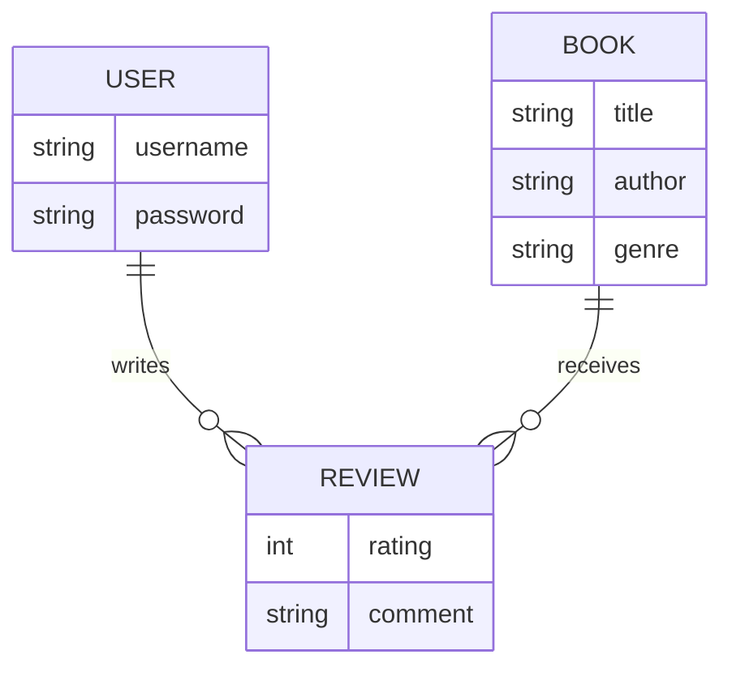

## Project Structure

```
book-review-api/
│
├── app.js                # Express app setup and middleware
├── server.js             # Entry point, starts the server
├── package.json          # Project metadata and dependencies
├── .env                  # Environment variables (not committed)
├── .gitignore            # Files/folders to ignore in git
│
├── config/
│   └── db.js  
│
├── models/               # Mongoose models for MongoDB collections
│   ├── User.js           # User schema and model
│   ├── Book.js           # Book schema and model
│   └── Review.js         # Review schema and model
│
├── routes/               # Express route handlers
│   ├── auth.js           # Routes for signup/login
│   ├── books.js          # Routes for book CRUD and search
│   └── reviews.js        # Routes for review CRUD
│
├── controllers/          # Business logic for routes 
│   ├── bookController.js # Book logic (CRUD, search)
│   └── reviewController.js # Review logic (CRUD)
|
├── middleware/ 
|   └── auth.js           # protect routes and verify JWT tokens for authentication
|
└── README.md             # Project documentation

```
- **app.js**: Sets up the Express app, middleware, and routes.
- **server.js**: Loads environment variables, connects to MongoDB, and starts the server.
- **config/db.js**: Handles MongoDB connection logic.
- **models/**: Contains Mongoose schemas for Users, Books, and Reviews.
- **routes/**: Defines API endpoints for authentication, books, and reviews.
- **controllers/**: Contains logic for handling requests for each resource.
- **middleware/**: To protect routes and verify JWT tokens for authentication.
- **.env**: Stores sensitive configuration like DB URI and JWT secret (excluded from git).
- **README.md**: Documentation and usage instructions.

---

<br>

# Database Schema Design

This project uses MongoDB with Mongoose ODM. Below is a brief schema design and a simple ER diagram for the main entities.

---

## Entities & Relationships

### User
- **_id**: ObjectId (Primary Key)
- **username**: String (unique, required)
- **password**: String (hashed, required)

### Book
- **_id**: ObjectId (Primary Key)
- **title**: String (required)
- **author**: String (required)
- **genre**: String (required)

### Review
- **_id**: ObjectId (Primary Key)
- **book**: ObjectId (Reference to Book, required)
- **user**: ObjectId (Reference to User, required)
- **rating**: Number (required)
- **comment**: String (optional)

---
  
## Relationships

- **User** (1) --- (M) **Review**
- **Book** (1) --- (M) **Review**
- Each **Review** references one **User** and one **Book**.
- Each **User** can review a **Book** only once.

---

## Simple ER Diagram



---

## Notes

- Passwords are stored as hashes, not plain text.
- The `Review` collection enforces one review per user per book at the application level.
- All references use MongoDB ObjectId.

---